# ZenStore🛍️

<h3>Description :</h3> 
This is an online E-commerce website where you can purchase products.

👉[Click here](https://zenstore.onrender.com/) to check out the app.
 

### 📃Features :

<ul>
<li>Login system</li>
<li>All the data is stored in the mongodb database</li>
<li>You can send us your queries from the contact section</li>
<li>You can view all the products available in stock before puchasing</li>
<li>You can filter out products based on category, company, colors, price</li>
<li>You can sort the products based on price and name</li>
<li>You also can view the products in list or grid view</li>
<li>There is a detailed page for each product</li>
<li>There is a Cart system where user can access only if they are logged in</li>
<li>You can increase or decrease the quantity of each item in the cart</li>
<li>You can also remove each item from the cart</li>
<li>You can also remove all items from the cart</li>
<li>There is also an admin management dashboard</li>
<li>Admin can view all the registered users</li>
<li>Admin has the control to remove any user</li>
<li>Admin can create any item for the store</li>
<li>Admin can remove any item from the store</li>
</ul>

### Sign Up page

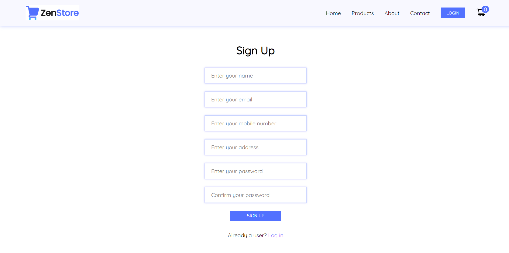

### Sign In page

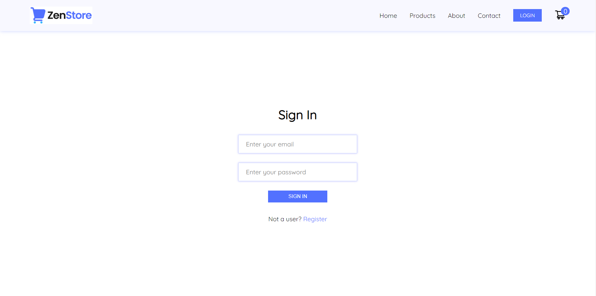

### Home page

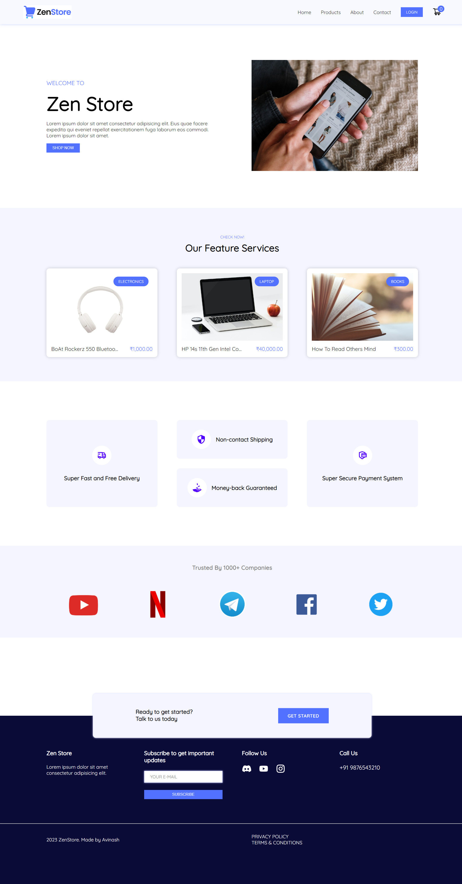

### Responsive navbar

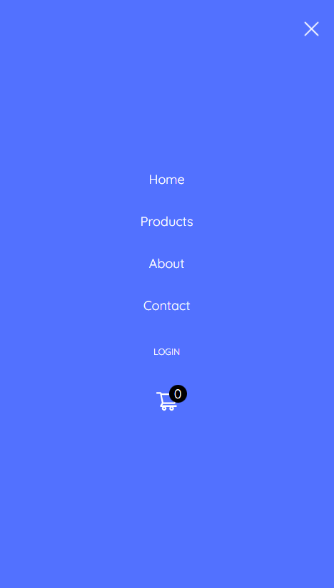

### All products page in list view

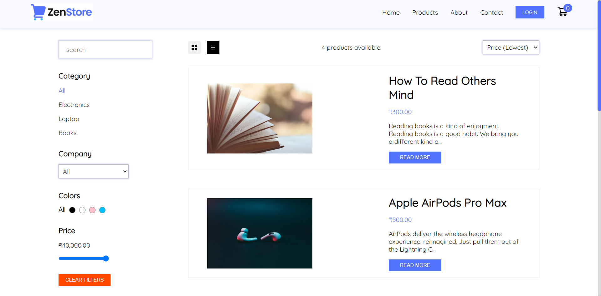

### All products page in grid view

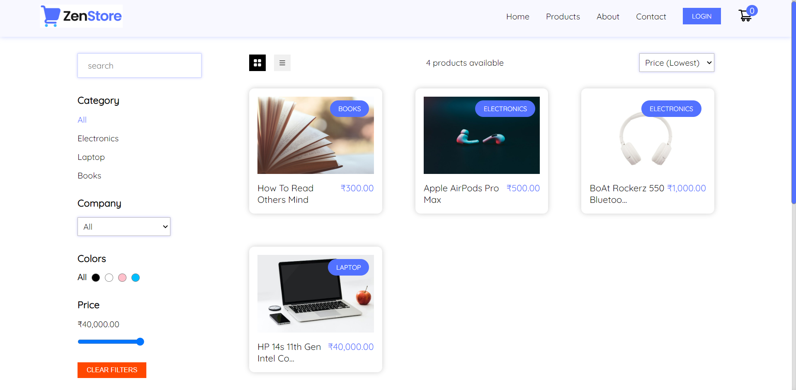

### Single product page

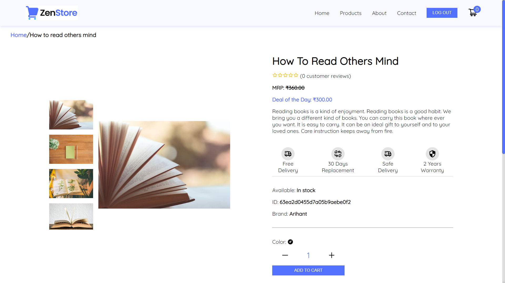

### Cart page

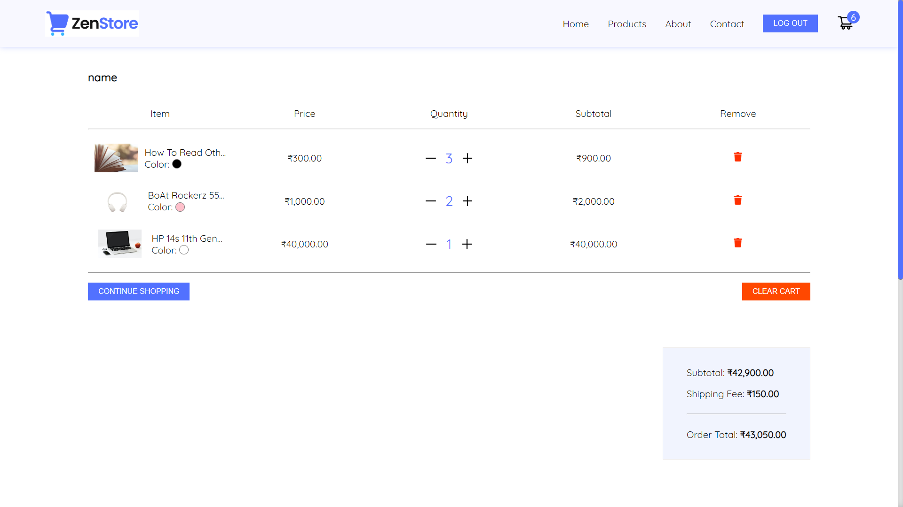

### Contact page

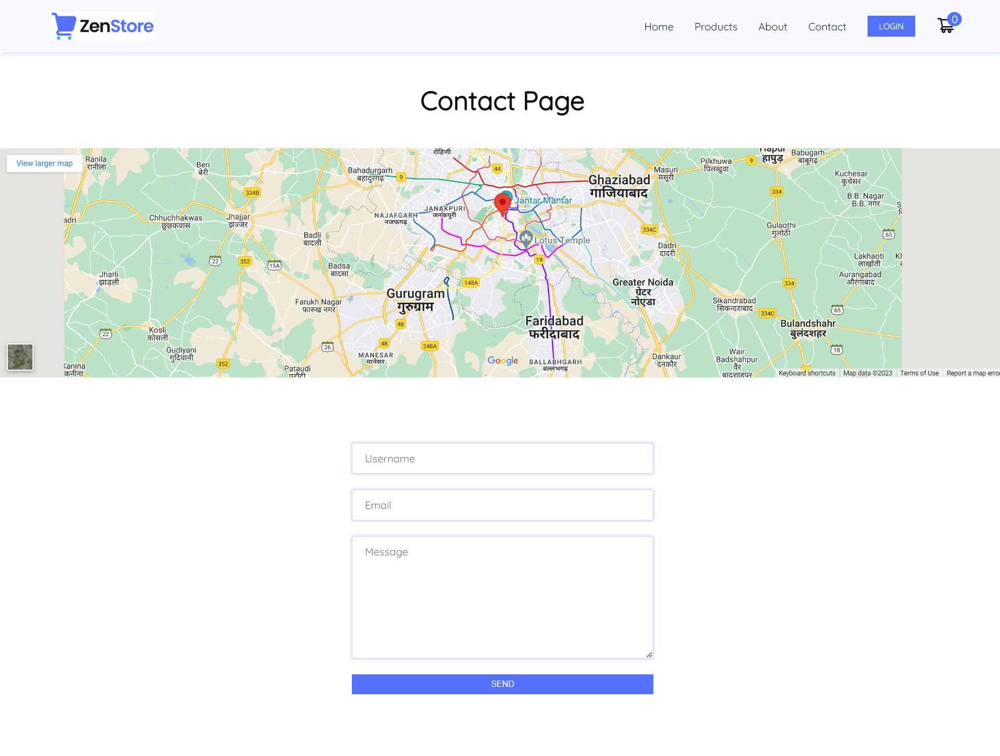

### Admin page to view all users

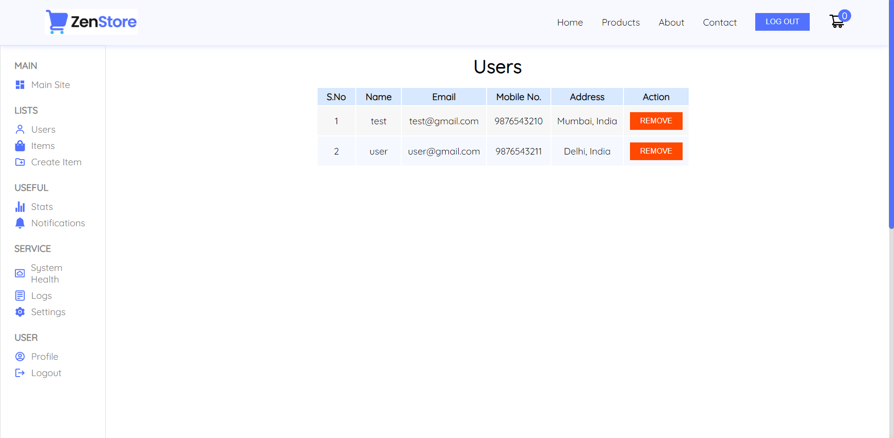

### Admin page to view all products

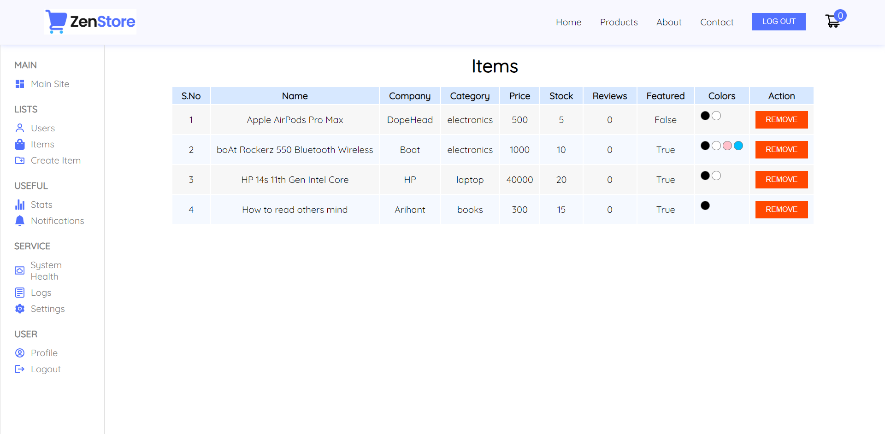

### Admin page to create a new product

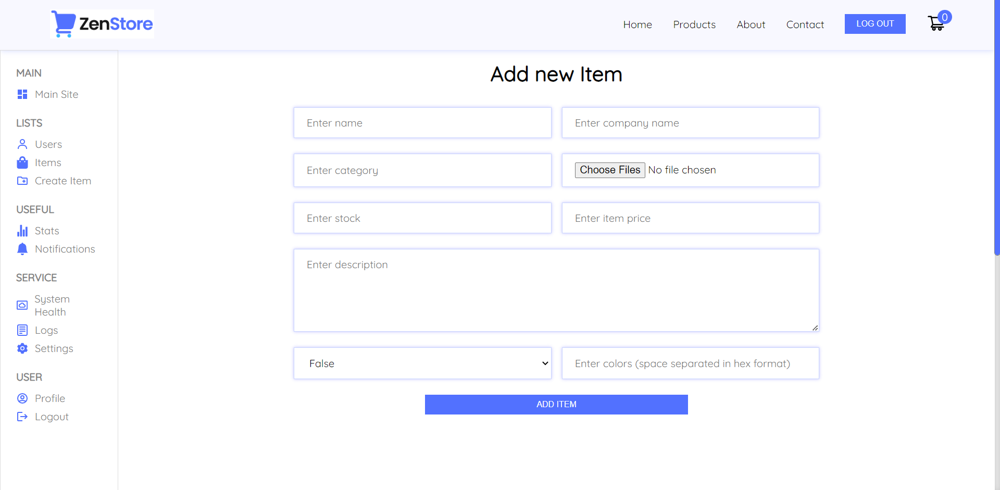

### Tools and technologies used :

 

### Connect with me :

